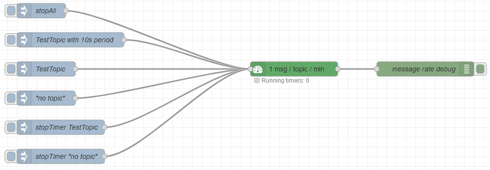

# Node-red node message-rate-topic

Limit the rate of `msg` with a specific `topic` to the set period.
If a message with a specific topic is received, it is sent out immediately.
The next `msg` with the same `topic` will be sent only after the configured period has passed.
Messages with the same `topic` received in the configured time period are discarded.

## Installation

```
cd ~/.node-red
npm install <path-to-module>/node-red-contrib-limit-message-rate-topic
```
or install through the _Palette_ menu.

## Message options

All Option are optional.

- `msg.topic` (`string`): The topic of the message (can be empty).

- `msg.stopTimer` (`boolean`): If set to `true`, the timer for `msg.topic` is stopped and the message is discarded.

- `msg.period` (`integer`): Overrides default period in timer.

- `msg.stopAll` (`boolean`): If set to `true`, all timers and messages, regardless of topic, are discarded.

If in the node configuration or in `msg.delay` a value < 1 is given, the node prints a warning and uses a default period of 5 seconds instead.

## Practical example

The example flow below (see `message-rate-topic/examples/example-flow-message-rate-topic.json`) configures a node with a rate of 1 message per topic per minute. You can test all available configurations with the insert nodes on the left side and see what the debug node on the right side produces to understand the node's behaviour.



## Credits

Inspired and some code re-used from [node-red-contrib-delay-topic-message](https://flows.nodered.org/node/node-red-contrib-delay-topic-message).

## Repository

[GitHub](https://github.com/pooh42/node-red-contrib-limit-message-rate-topic) - the nodes github repository
